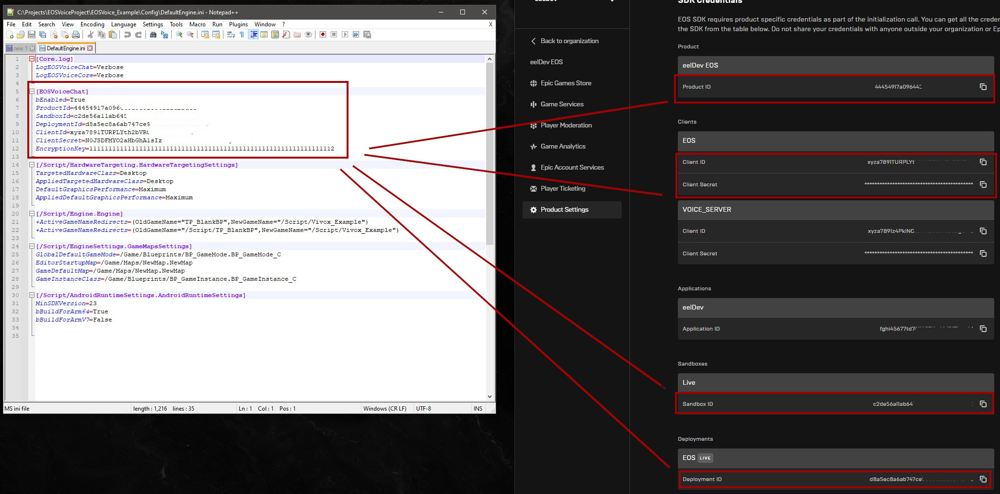

# DefaultEngine.ini

Open up your Project\Config\DefaultEngine.ini file with Notepad, copy-paste the values below and replace them with your own values from the Developer Portal

```
[EOSVoiceChat]
bEnabled=True
ProductId=44454917a096443a
SandboxId=c2de56a11ab6454d8b
DeploymentId=d8a5ec8a6ab747ce9
ClientId=xyza7891TURPLYth2bV
ClientSecret=N0JSDFMYO2aHbGh
EncryptionKey=1111111111111111111111111111111111111111111111111111111111111112
```

