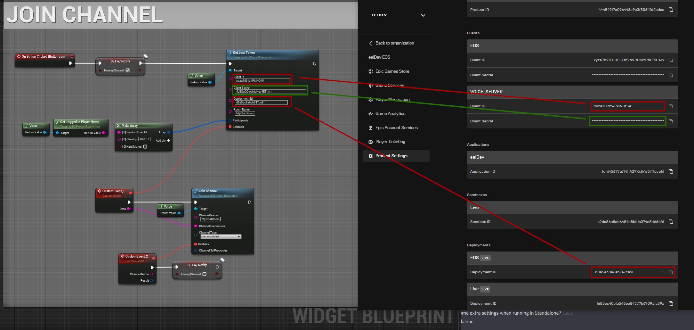

# Joining a channel
- After creating your Trusted Server credentails we can use them to request tokens from the EOS Web API, use the “GetJoinToken” function and wait for a callback, the data returned should be a json formatted string that will then be parsed in the “JoinChannel” function.

