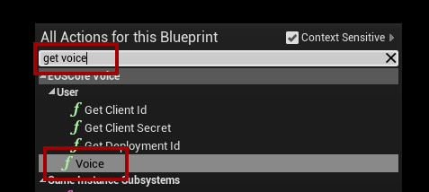
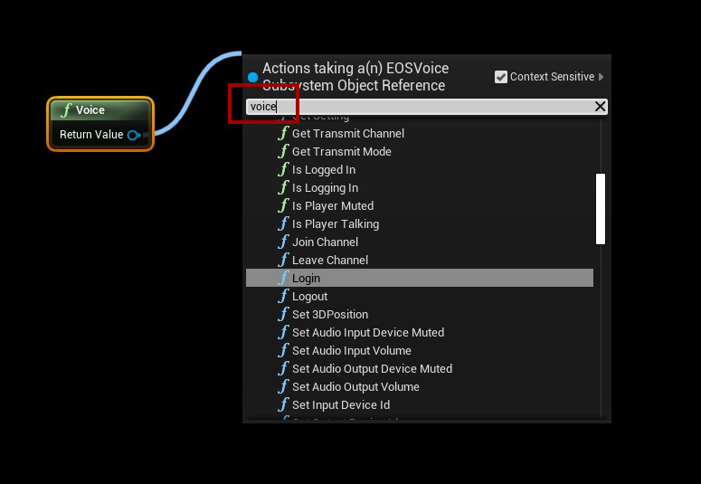

# Voice Functions
- To get a list of all available EOS Voice functions, first enter “get voice” in the context browser to get a reference to the voice system.

- Search for “voice” after dragging a pin out from the “Voice” node, this will give you a list of all available functions that you can use with the EOSCore Voice plugin

