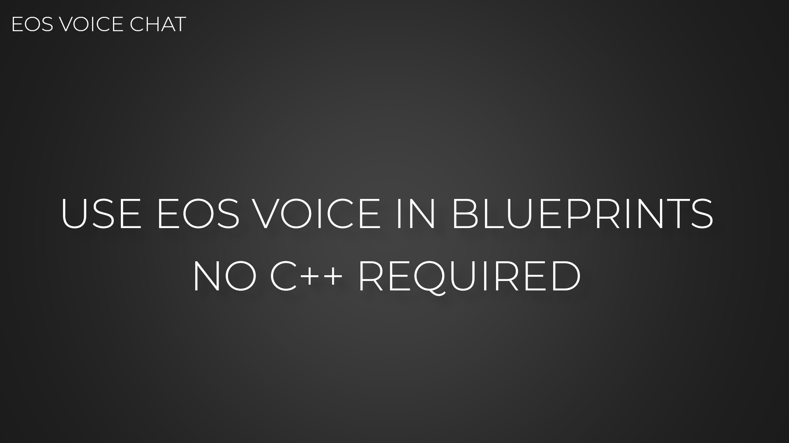
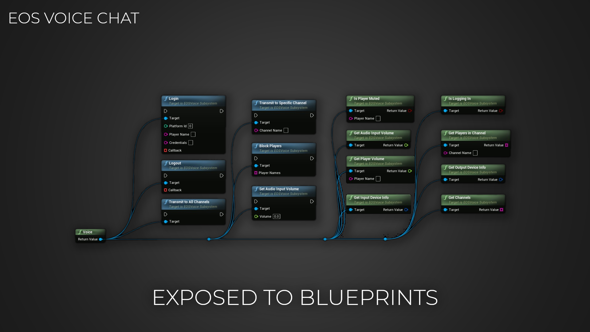
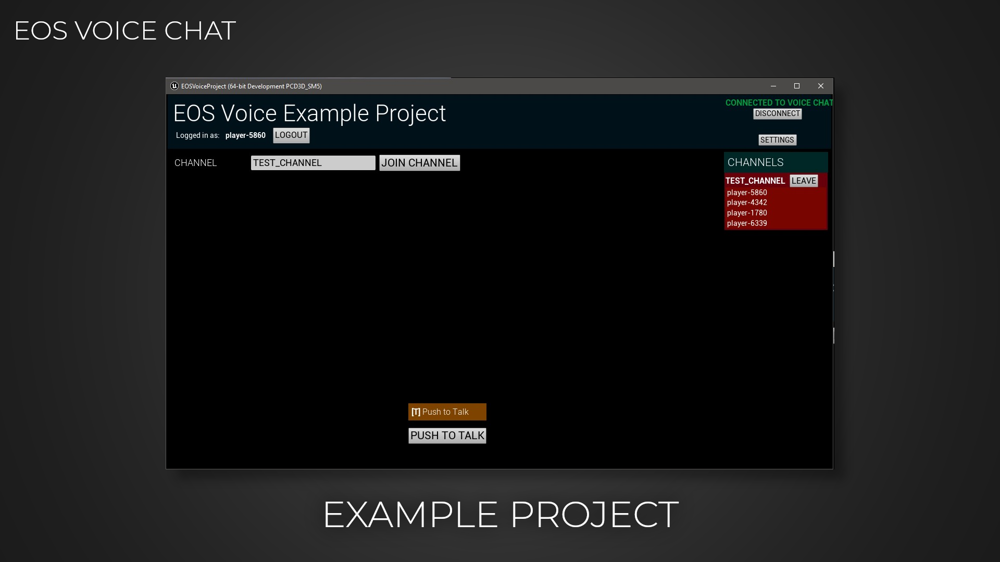

import Tabs from '@theme/Tabs';
import TabItem from '@theme/TabItem';

# EOSCore Voice Documentation

# What is the EOSCore::Voice plugin
The EOSCore Voice plugin is a blueprint wrapper plugin for the EOSVoiceChat plugin that was released with the 4.27 version of Unreal Engine.

It allows you to use the IVoiceInterface in blueprints so that you don’t have to do any c++ in your blueprint projects.

<Tabs>
  <TabItem value="image" label="Image" default>
    
  </TabItem>
  <TabItem value="image2" label="Image 2">
    
  </TabItem>
  <TabItem value="image3" label="Image 3">
    
  </TabItem>
</Tabs>

