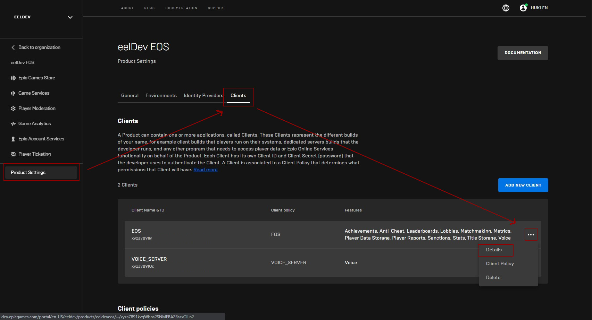
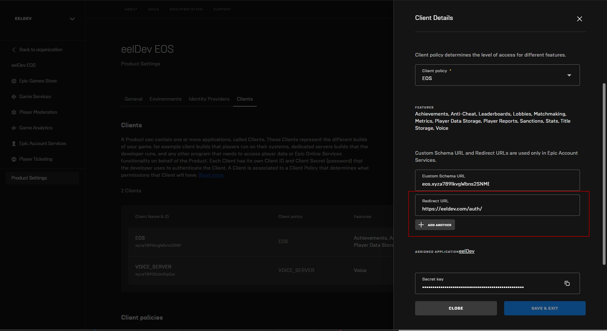
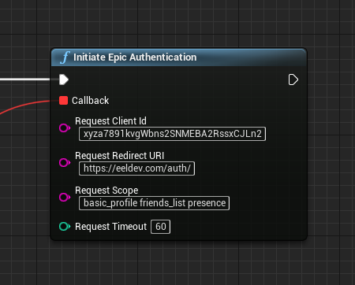
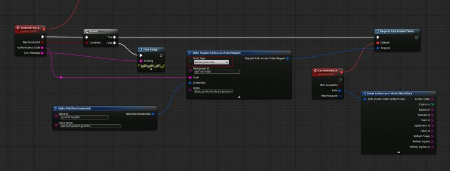

# Auth
Epic Games Services uses the OAuth 2.0 protocol for authentication and authorization, supporting common-use cases for web servers and client-side applications. Epic has also introduced custom grant types for some specific use cases.

Before starting, you will need to obtain OAuth 2.0 client credentials from Epic. These will be in the form of a Client ID and Client Secret, and will be used when requesting an access token from the Epic authorization server. See our guide on Getting Started with Epic Account Services for more details.

https://dev.epicgames.com/docs/services/en-US/WebAPIRef/AuthWebAPI/index.html

https://dev.epicgames.com/portal

:::note
Note that the AccessToken in this example will not work for creating a RoomToken as that requires a TrustedServer Client. You must use the Connect interface for this.

**Note that this authentication flow is not supported on Mobile devices.**
:::

## Setting up a Redirect URL
Before getting started we need to setup our Redirect URL, the web browser will redirect the user to this address upon successful Epic Authentication and the plugin will then use this URL to determine the Authentication Code from the user.

- Begin by logging into your Developer Portal and go to your Product Settings

- In this example we’re going to be using https://eeldev.com/auth as our Redirect URL, you can setup your own Web Server to use for this, but you can also continue to use the eelDev host if you wish.

## Initiate Epic Authentication
- You can use the Web plugin to Authenticate using Epic Accounts to get a Epic Account AccessToken, lets take a look at an example.
- The first step is to invoke “InitiateEpicAuthentication”, this node will attempt to open a Web Browser for the user so that they can authenticate with their Epic Account, after they’ve authenticated they will be redirected to the “Redirect URI” parameter. In this example you’ll be redirected to the eelDev host where the plugin will attempt to get the Authentication Code returned from Epic.
- Feel free to use your own web host for the Redirect URL.

## Requesting Auth Access Token
- After receiving our Authentication Code from the Initiate Epic Authentication function we’re going to use this code to Authenticate with the EOS Web API, see the example below.
- Note that the AccessToken in this example will not work for creating a RoomToken as that requires a TrustedServer Client. You must use the Connect interface for this.

