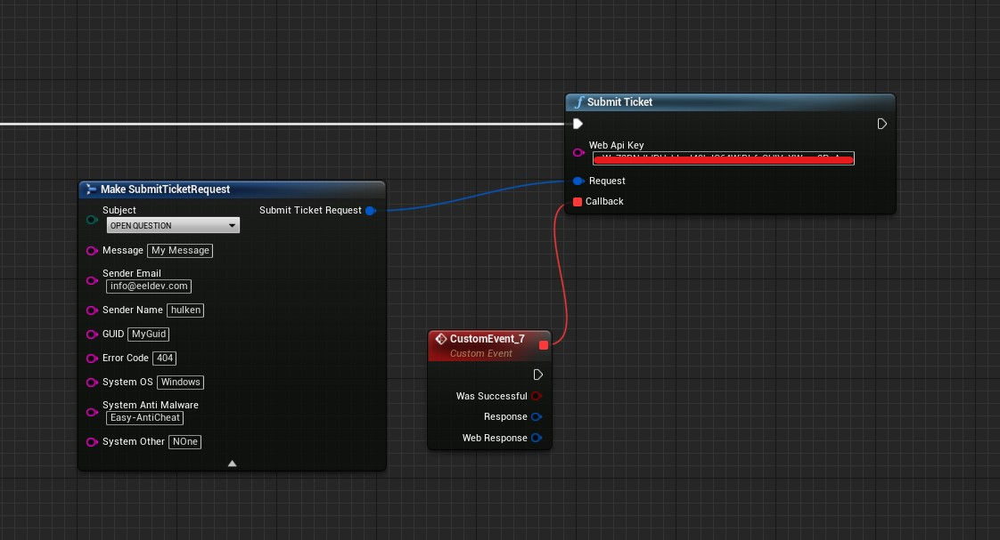
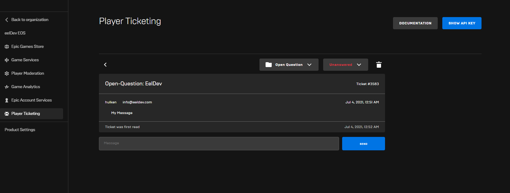

# Player Tickets
Epic Online Services (EOS) provides a Ticketing System to support your products from a centralized location using an automatically generated, preassigned email address and a public web API key. The ticketing system supports:

Tracking open, in-progress, and closed tickets
Merging related tickets
Replying to end-users who have submitted a ticket and receiving replies

## Web API Key
- First off you must get your Web API Key from the Epic Developer Portal for your Product/Application, you can find this by going to “Player Ticketing” > “Show API Key” Button

## Submitting a ticket
- The EOSCoreWeb module makes it easy to submit tickets, all you have to do is enter your Web API Key and fill out the information you need in the Request

## The Result

