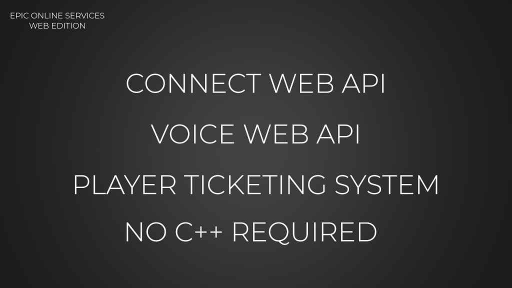
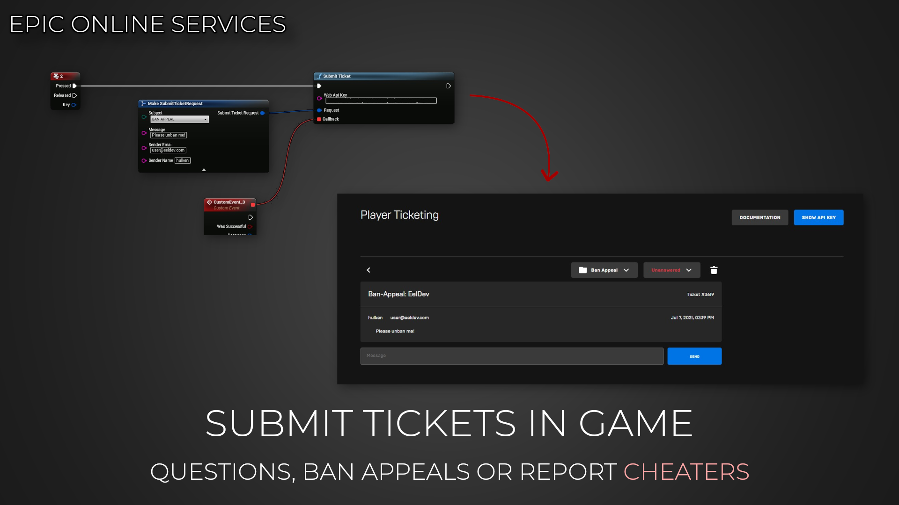

import Tabs from '@theme/Tabs';
import TabItem from '@theme/TabItem';

# Introduction

## The EOSCore Web Plugin
The EOSCore::Web plugin allows you to communicate with the EOS Web API using Blueprints, the WEB Api can be used to create Room Tokens for your Voice Chat channels, submit In game Player Tickets and more..

https://dev.epicgames.com/docs/services/en-US/WebAPIRef/index.html

<Tabs>
  <TabItem value="image" label="Image" default>
    
  </TabItem>
  <TabItem value="image2" label="Image 2">
    
  </TabItem>
</Tabs>