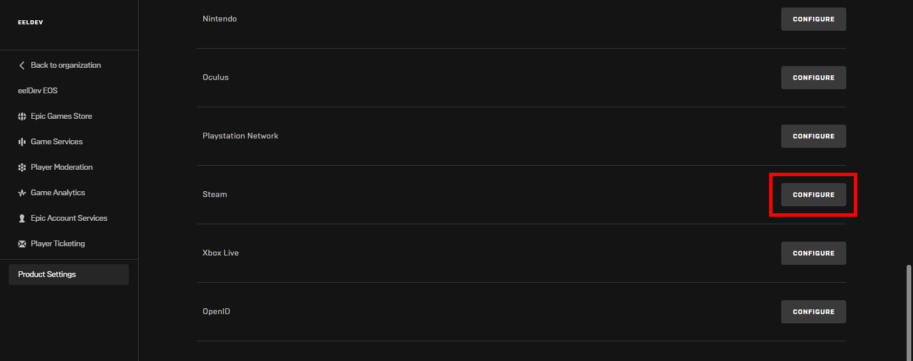
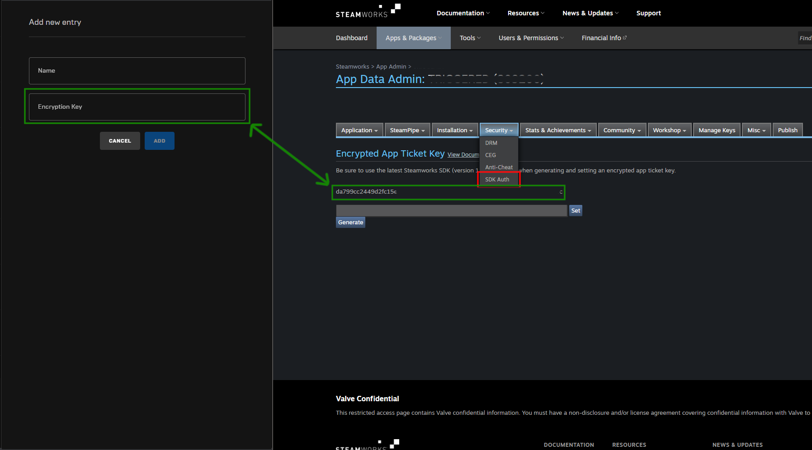

# Authentication: Steam Session Ticket

## Requirements
- Your own AppId on Steam
- Configure your Product to allow Steam as your Identity Provider in the EOS Dev Portal
- A method to acquire Steam Session App Tickets

:::warning
Requires EOSCore 1.9.6.7 and later.
:::

## Configuring your Project
- Login Epic Dev Portal




- Configure the Steam Identity Provider and add a New Entry, the Encryption key needed is found in the next secion of this tutorial

## Steam Appticket Key
- Login to your Steamworks account and select your Game/Application, under **Technical Tools** click on **Edit Steamworks Settings**.
- Inside your Applications Steamworks Settings, go to the **Security** tab and click on **SDK Auth**, here you will be able to generate the **Encryption Key** that you need for your EOS Product to Authenticate.
- **[Login to Steamworks](https://partner.steamgames.com/home)**




# Configuring the Identity Provider
- Next up we’ll configure our Product to allow Steam as an Identity Provider, go to your **Product Settings**, click on **Environments** and then click on **IDENTITY PROVIDERS**


- Select the Steam App that we created in our previous step **My Steam App**


- We will use this NetworkIdentifier later


## Logging in with Steam
- First we need to request a **Auth Ticket for Web Api** from Steam so that we can authenticate with EOS. In this example we're going to use the [SteamCore PRO Plugin](https://www.unrealengine.com/marketplace/slug/459e1c72939b4ead8b5132187808a3e7) plugin to retrieve the key.
- We begin by listening for the callback **Get ticket for Web Api Response** before calling the **Get Auth Ticket for Web Api** function, note the Identifier here is the same one we defined earlier, in this example "**STEAMCORE**".
- On callback we unbind the event so it does not fire the Login node multiple times later in the project when we try to refresh login tokens, then call the Login node using the Ticket. 


## Refreshing Login Tokens
- EOS login tokens have an expiration time (currently **60** minutes at the time of writing this article), which means they need to be refreshed every ~**60** minutes.
- The EOS SDK will let us know when this needs to happen so all we have to do is listen for that by adding the **EOS_Connect_AddNotifyAuthExpiration** function and then provide the Online Subsystem with our new Steam Session Ticket.
- Use the **Update Steam Session Ticket** function to update the cached session ticket in the online subsystem module, which the plugin will use to refresh the login token.
- This logic should only be fired once, for example in your Game Instance.
- The rest will be taken care of the plugin, just make sure to update the **Steam Session Ticket**


## Using SteamCore PRO and EOSCore together (DefaultEngine.ini)
- In addition to configuring SteamCore PRO plugin you'll need to set the NativePlatformService to SteamCore which allows the SteamCore plugin to initialize.
```cpp
[OnlineSubsystem]
DefaultPlatformService=EOSCore
NativePlatformService=SteamCore
```