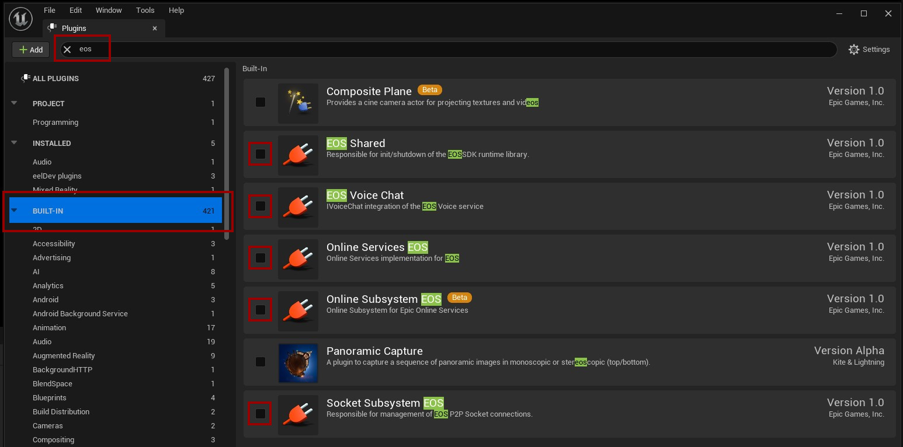
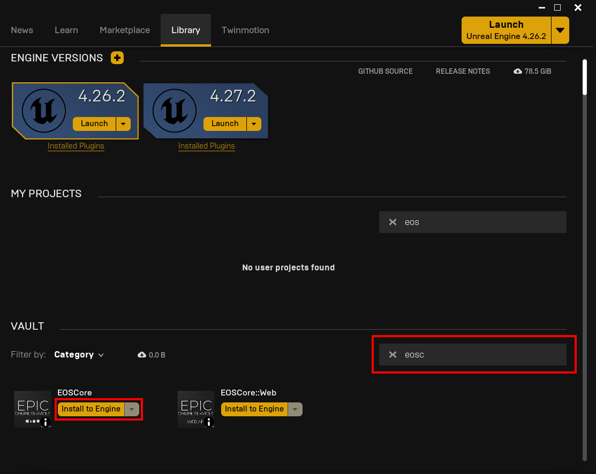
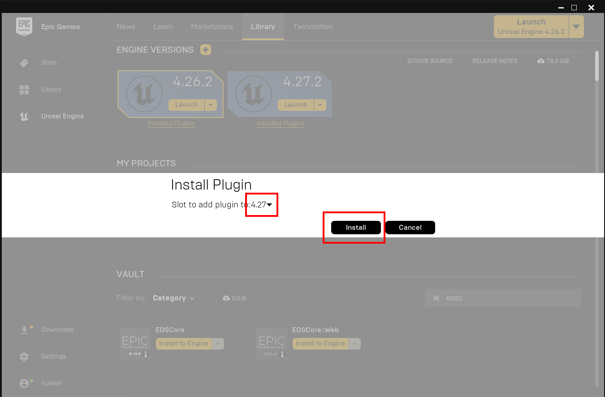
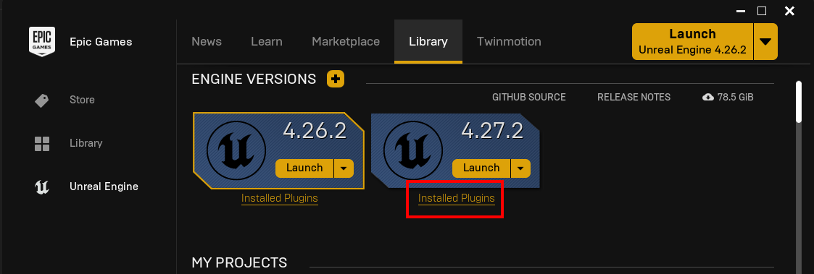
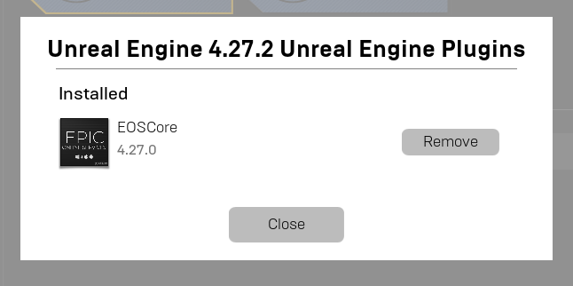

# Installing the EOS Plugin

## Overview

This guide provides step-by-step instructions for installing the EOSCore plugin through the Epic Games Launcher. The plugin enables Epic Online Services functionality within your Unreal Engine project.

## Video Tutorial

For a visual walkthrough of the installation process, please refer to our [Video Tutorial](../videos/installing-and-configuring.mdx).

## Prerequisites

### Disable Engine EOS Plugins

Before installing the EOSCore plugin, you must disable the default EOS plugins that are included with the Unreal Engine. These built-in plugins will conflict with the EOSCore plugin and cause functionality issues.

**Required Actions:**
1. Navigate to your engine's plugin directory
2. Locate the default EOS plugins
3. Disable all engine-provided EOS plugins as shown below

:::warning Critical Step
Failure to disable the engine's default EOS plugins will result in plugin conflicts and prevent proper functionality.
:::

## Installation Process

### Step 1: Locate the Plugin

1. Open the Epic Games Launcher
2. Navigate to the Unreal Engine marketplace or plugin library
3. Search for the **EOSCore** plugin
4. Click **Install to Engine** to begin the installation process

### Step 2: Select Target Engine Version

1. A dialog will appear prompting you to select your target engine version
2. Choose the appropriate Unreal Engine version (e.g., 4.27 as shown in the example)
3. Click **Install** to proceed with the installation

The Epic Games Launcher will automatically download and install the plugin for your selected engine version.

### Step 3: Installation Verification

After the installation process completes, verify that the plugin has been successfully installed:

1. Check the plugin status in the Epic Games Launcher
2. Confirm the plugin appears in your engine's plugin list
3. Verify the installation was completed without errors

## Post-Installation

Once the plugin installation is verified, you can proceed to enable the EOSCore plugin in your Unreal Engine project and begin configuration as outlined in the subsequent documentation sections.

## Troubleshooting

If you encounter issues during installation:

- Ensure you have properly disabled all engine EOS plugins
- Verify you have sufficient disk space for the installation
- Check that your Epic Games Launcher is up to date
- Restart the launcher if the installation appears to hang

For additional support, consult the official plugin documentation or community forums.