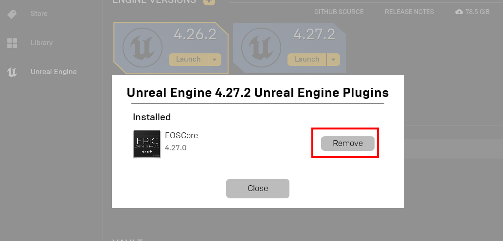

# Updating the EOS Plugin

## Overview

This guide outlines the recommended process for updating the EOSCore plugin. Due to limitations in the Epic Games Launcher's plugin update mechanism, a clean reinstallation is the preferred method to ensure proper functionality and avoid potential conflicts.

## Why Clean Installation is Recommended

The Epic Games Launcher's plugin update feature may not always properly handle plugin updates, which can result in:
- Incomplete file replacements
- Residual configuration conflicts
- Compatibility issues with newer versions
- Corrupted plugin installations

To avoid these issues, we recommend performing a complete uninstall and reinstall process.

## Update Process

### Step 1: Locate Current Installation

1. Open the Epic Games Launcher
2. Navigate to your Engine version's plugin section
3. Click on **Installed Plugins** for your specific Engine version


### Step 2: Uninstall Current Plugin

1. Locate the EOSCore plugin in your installed plugins list
2. Click the **Remove** button to uninstall the plugin
3. Confirm the uninstallation when prompted



Allow the Epic Games Launcher to complete the uninstallation process.

### Step 3: Manual File Cleanup (Recommended)

For a thorough cleanup, manually verify that all plugin files have been removed:

1. Navigate to your Unreal Engine installation directory
2. Access the following path (replace `4.27` with your engine version):
   ```
   C:\Program Files\Epic Games\UE_4.27\Engine\Plugins\Marketplace\EOSCore
   ```
3. If the EOSCore folder still exists, delete it manually
4. Empty the Recycle Bin to ensure complete removal

:::tip Best Practice
Manual file cleanup helps prevent potential conflicts that may arise from incomplete automatic uninstallation.
:::

### Step 4: Reinstall the Plugin

Once the cleanup process is complete:

1. Follow the standard [plugin installation procedure](./installing_plugin.md)
2. Ensure you select the correct engine version during installation
3. Verify the installation completed successfully

## Post-Update Verification

After reinstalling the plugin:

1. **Project Compatibility**: Open your existing projects and verify the plugin loads correctly
2. **Configuration Check**: Review your plugin settings to ensure they match your previous configuration
3. **Functionality Test**: Test core plugin features to confirm proper operation

## Troubleshooting

If you encounter issues during the update process:

- **Plugin Not Uninstalling**: Restart the Epic Games Launcher and try again
- **Manual Deletion Required**: Use administrator privileges if you cannot delete plugin files
- **Installation Fails**: Ensure you have sufficient disk space and proper permissions
- **Project Errors**: Check that the plugin is properly enabled in your project settings

## Alternative Update Methods

While clean installation is recommended, you may also consider:

- **Engine Update**: Updating your entire Unreal Engine installation
- **Direct Download**: Obtaining the latest plugin version directly from the developer (if available)

However, these methods may not provide the same level of reliability as the clean installation approach.